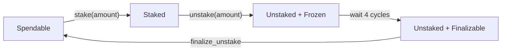

# Staking and Adaptive Issuance

Staking is an update to the "Proof of Stake" Mechanism in Tezos.

Before Staking, the only way for Tez holders to participate in the network was by delegating their tokens to a baker. Delegated funds contributed to a delegate's voting and baking power, but were not subject to staking: they could not be slashed in case the baker misbehaved. This is a useful feature for many users, but limits the total amount ot staked tez to the amount of tez that bakers themselves hold. In other words, if participating in the "Proof of Stake" mechanism required setting up and maintaining a baker, which is a significant barrier to entry for many users.

Staking changes this by allowing any user to participate in the "Proof of Stake" mechanism without setting up a baker. Users can now stake their tokens directly, and their staked tokens will be subject to slashing in case of misbehavior. This allows the total amount of staked tez to be much higher than the amount of tez that bakers themselves hold, which in turn increases the security of the network.

Users can control their staked funds using the `stake`, `unstake`, and `finalize_unstake` operations. These are implemented as pseudo-entrypoints, and the parameters are passed to a transfer operation with the same destination as the sender.

To accept staked funds, a delegate needs to have opted in to staking. This is done by `set_delegate_parameters`. This part is not supported by Taquito, as it is not a dApp operation. More information [here](https://tezos.gitlab.io/paris/adaptive_issuance.html#staking-policy-configuration).

# Staking Funds
To stake your funds, you need to call the `stake` operation.
You need yo have delegated your funds to a baker before you can stake them.

```javascript

// TODO: Add code after the implementation is done

```

# Unstaking Funds

To unstake your funds, you need to call the `unstake` operation. This will change your fund's status to "Unstaked +  Frozen"
The unstaked funds will still be frozen (and subject to slashing for 4 cycles). After that, your funds will be in "Unstaked + Finalizable" state.

```javascript

```

# Finalizing Unstake

To finalize your unstaked funds, you need to call the `finalize_unstake` operation. This will change your fund's status to "spendable".

```javascript

```

# Additional Info and Some Notes

## Cycle
At the time of this writing, a cycle is 16384 blocks, and 15 seconds per block. This means a cycle is about 2.8 days. This changes with the activation of newer protocols.

## Overstaking
A delegate can set the maximum amount of staking they can accept, as a multiply of their own balance. If a delegate's limit is exceeded, the exceeding stake is automatically considered as delegation for the delegate's baking and voting power calculation, but it does remain slashable. That means it's your responsibility to make sure you're not overstaking.

```javascript
// Todo: check for overstaking
```

## Changing Delegate
When you change your delegate, your funds will be automatically unstaked. You will have to wait for 4 cycles before you can stake them again.

## No need to finalize_unstake in some cases
The `stake` and `unstake` operations will automatically finalize all currently finalizable funds.

## Adaptive Issuance
A concept related to staking is adaptive issuance. Adaptive issuance is a mechanism that adjusts the block reward based on the total amount of staked tez. In short, the reward will be adjusted to keep the staked funds about 50% of the total supply. To read more about the mechanism you can check [this document](https://tezos.gitlab.io/paris/adaptive_issuance.html#adaptive-issuance).

## Staking Rewards
In delegation, rewards were given to the baker, and it was the baker's responsibility to distribute the rewards to the delegators. In staking, the rewards are given directly to the staker. However, rewards are not given immediately. // TODO: how long does it take for rewards to be given?

## Feature activation
Voting for Staking is being done differently from other protocol updates. It is included in the "Oxford" protocol, and after "Paris" is activated, this feature can be voted on separately.

# Exclude

## Lifetime of Staked Funds

Before you stake some of your Tez, it is in "Spendable" state. When you stake it, it will be in "Staked" state. When you unstake it, it will be in "Unstaked + Frozen" state, this fund is still subject to slashing. After 4 cycles, it will be in "Unstaked + Finalizable" state. You can finalize it to make it "Spendable" again.



## Staking Rewards

The static and dynamic rewards, how these are adjusted based on the staking ratio, and how the rewards are distributed regarding the `edge_of_baking_over_staking` parameter.

Comparison of the rewards in delegation and staking.

## staking using octez-client

- set_delegate_params: 
  - longer: `octez-client transfer 0 from <delegate> to  <delegate> --entrypoint set_delegate_parameters --arg "Pair <limit as int value in millionth)> (Pair <edge as int value in billionth> Unit)"`
  - shorter: `octez-client set delegate parameters for  <delegate> --limit-of-staking-over-baking <value> --edge-of-baking-over-staking <value>`
- stake:
  - longer: `octez-client transfer <amount> from <staker> to <staker> --entrypoint stake`
  - shorter: `octez-client stake <amount> for <staker>`
- unstake:
  - longer: `octez-client transfer <amount> from <staker> to <staker> --entrypoint unstake`
  - shorter: `octez-client unstake <amount|"everything"> for <staker>`
- `octez-client transfer 0 from <staker> to <staker> --entrypoint finalize_unstake`
  - `octez-client finalize unstake for <staker>`

## Details of the feature voting process

- voting phase:
  - block producing delegates can vote in each block, or pass (default)
  - Exponential moving average with half life of 2 weeks
  - target: 80% supermajority of on over on+off votes
  - No time limit
  - will complete at the end of the cycle
- adoption phase:
  - 5 cycles
  - no returning back implemented

## Details of set_delegate_parameters
  - edge_of_baking_over_staking
  - limit_of_staking_over_baking

## Showing the different balances before and after each operation (and after the 4 cycle wait period)
