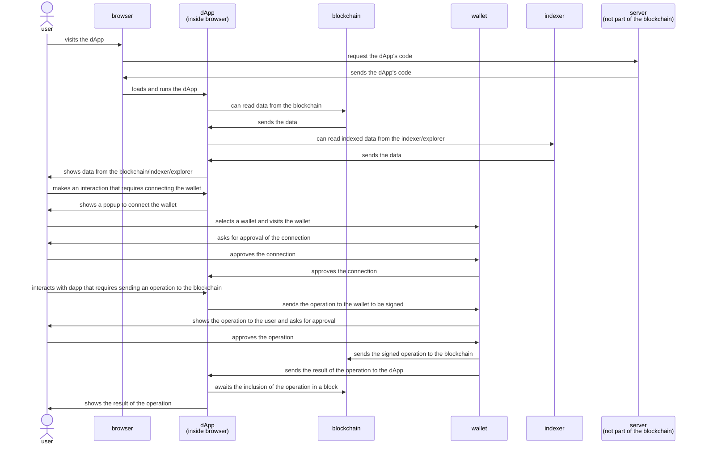

import Tabs from '@theme/Tabs';
import TabItem from '@theme/TabItem';

## Introduction

In this tutorial, we will walk through the process of creating a simple dApp (short for "Decentralized Application") using Taquito. We will:

1. Create a simple command-line application that reads the balance of an address from the blockchain
1. Establish a high-level understanding of the blockchain, Tezos, dApps, and Taquito
1. Send a `Transfer` operation to the blockchain using Taquito
1. Interact with a smart contract using Taquito
1. Implement a simple GUI dApp

## Prerequisites

### Prior knowledge

In order to follow this tutorial, you need to have some understanding about the following concepts:
- Basic knowledge of JavaScript and programming in general
- A high-level understanding of blockchain technology and ecosystem (we will also cover this briefly in the tutorial)

### Development machine

We need a development machine with the following software installed:
- [Node.js](https://nodejs.org): one of the current versions (LTS recommended)
- A code editor like VS Code, or any other editor of your choice
- Optionally: docker (for creating your own key pair)

This tutorial should work on Windows, Linux, and macOS. On other systems like a Chromebook or a tablet, you might need additional setup not covered in the tutorial.

:::info
If you are using windows, there are two ways to run the commands in this tutorial: inside a WSL2 terminal, or inside the PowerShell. Generally, WSL2 is recommended for programming. But if you prefer, you can still use PowerShell. If you use WSL2, you can use the same commands as Linux. For PowerShell, we will provide commands in a separate tab **only when they are different from Linux**.
:::

## Let's start with a simple command-line application {#start-coding}

In this section, we will create a simple command-line application that shows the balance of an address. This will help us understand the basics of Taquito and the flow of events in a dApp.

Open a terminal and run the following commands:

<Tabs
defaultValue="linux"
values={[
{label: 'Linux & mac', value: 'linux'},
{label: 'Windows Powershell', value: 'windows'}
]}>
  <TabItem value="linux">

```bash
mkdir my-cli-dapp
cd my-cli-dapp

npm init -y
npm i -D typescript ts-node
```

  </TabItem>
  <TabItem value="windows">

```bash
md my-cli-dapp
cd my-cli-dapp

npm init -y
npm i -D typescript ts-node
```

  </TabItem>
</Tabs>
Then, create a file named `index.ts` in the folder `my-cli-dapp` and add the following code:

```ts
console.log("Hello Blockchain!");
```

Now, run the following command in the terminal:

```bash
npx ts-node index.ts
```

If everything is done right, you should be able to see the output `Hello Blockchain!` in the terminal.
Now, we can start using Taquito to interact with the Tezos blockchain.
Run the following command to install Taquito:

```bash
npm i @taquito/taquito
```

Now, open the file `index.ts` and replace the code with the following:

```ts
import { TezosToolkit } from "@taquito/taquito";

var tezosToolkit = new TezosToolkit("https://ghostnet.ecadinfra.com");

tezosToolkit.tz.getBalance("tz1YvE7Sfo92ueEPEdZceNWd5MWNeMNSt16L").then(balance => {
    console.log(balance.toNumber());
});
```

Running `npx ts-node index.ts` should now show the balance of the specified address. This balance is in units of Mutez (micro Tez). Tez is the currency of Tezos, its code is `XTZ`, and the symbol is `ꜩ`. 1 Tez is 1,000,000 Mutez.

Congratulations! You have just interacted with the Tezos blockchain using Taquito. In the next section, we will establish a high-level understanding of the blockchain, Tezos, dApps, and Taquito. If you are already familiar with these concepts, you can skip to [Sending a Transfer operation to the blockchain using Taquito](#sending-operations).

## What is a blockchain?
The blockchain is a way to trust a network of computers run by strangers (so you don't have to trust the individual people). It might seem impossible, but it works. How?

All computers that form a blockchain run the same software. They also store all the information needed to verify the integrity of the data. So anyone can verify that the data is correct. Techniques from cryptography are used to make this possible.

In order to work with a blockchain, a high level understanding is enough:

1. The blockchain is a network of computers that run the same software.
1. The blockchain stores data in a way that anyone can verify the integrity of the data.
1. The data is split into "blocks". Each block contains a list of operations (like sending some tokens from one account to another).
1. Once a block is created and the blockchain reaches a consensus on the information in it, it is impossible to change the data in the block.
1. In order to send an operation to the blockchain, you can send it to any of the nodes participating in the consensus. The node will forward the data to the other nodes.
1. In order to read data from the blockchain, you can send a request to any of the nodes.
1. Anyone can read data from the blockchain. But to send an operation to the blockchain, it needs to be cryptographically signed.

Like any complex system, the simple overview we just gave is vastly simplified by leaving out a lot of details, and avoiding unnecessary precision. I believe having a good mental model of the system is more important than being precise. As you keep working in the blockchain ecosystem, your mental model will become more accurate over time.

<details>
  <summary>How does the blockchain work?</summary>

Here, I try to explain the overall mechanism that enables the blockchain to work. This is not necessary to understand the rest of the tutorial. But if you are curious, read on. Also, this is by no means a complete explanation. I am leaving out a lot of details.

As said earlier, the data to be written to the blockchain is divided into blocks. Each block contains a list of operations, and a cryptographic hash (like sha256) of the block is calculated. The hash is a short string that uniquely identifies the block. The hash of the previous block is also stored in the block. So the blocks are effectively making a chain, hence the name "blockchain".

This chaining has an interesting property: if you change the data in a block, the hash of the block will change. Because the hash of this block is stored in the next block, the hash of the next block will also change, and now you have to change the hash of all blocks after that. This feels like branching out another chain from the block you changed. Your branch will never reconcile with the original, unmodified chain.

This also has another interesting property: if you want to make sure that you agree with another computer on the entire contents of the blockchain, you just need to compare the hashes of the last blocks. If the hashes are the same, you agree on the entire contents of the blockchain before that block.

This is fine as long as all computers agree on the hash. But what if an attacker wants to advertise the wrong block? The network needs a way to establish a "majority" of votes. So that the "honest" nodes can still agree on the correct block even if some nodes are dishonest. This is done using a "consensus algorithm".

We need to make it hard for an attacker to dominate the honest votes. If every node on the network had the same vote, the attacker could just create a lot of nodes and vote for the wrong block. So, we need a way to have some voting power that favors the real majority.

When Bitcoin was invented, it used a consensus algorithm called "Proof of Work". In this algorithm, the computers compete to solve a puzzle. The first computer to solve the puzzle gets to create the next block. If an attacker manages to beat the rest of the network on one block, the honest nodes still have a higher chance of finding the next block based on the block they agree on. So, the attacker needs to have more computing power than the rest of the network combined. With a large network like Bitcoin, this is very expensive and not practical.

While POW is a genius solution, it is also very energy-intensive. It is estimated that the Bitcoin network uses as much energy as the entire country of Argentina. This is not sustainable.

A later generation of blockchains introduced the "Proof of Stake". In this algorithm, the computers that participate in the consensus are selected based on the amount of tokens they have. The more tokens you have, the higher your chance of being selected to create the next block. This is much more energy-efficient. The Tezos blockchain uses this algorithm.
</details>

## What makes Tezos different? {#about-tezos}

Some interesting features in Tezos are designed to address the shortcomings of the earlier generations of blockchain. When Tezos was created, it had these benefits over existing blockchains:

1. Proof of stake (It is now being adopted by some other blockchains as well). This eliminates a big problem with earlier blockchains: the need for a lot of energy to run the network.
1. Evolution of the blockchain. Remember that the blockchain is a network of computers that run the same software. This means that if you want to upgrade the software, all the nodes need to be upgraded at the same time. This is not easy to do. Tezos solves this problem by having evolution baked into the protocol. This means that the blockchain can evolve over time without the need for a "hard fork".
1. Delegation: Users can "delegate" their funds to a "baker". The baker will participate in the network consensus and will receive rewards. The baker will then share the rewards with the delegators. This makes it possible for users to participate in the network consensus without the need to run a node themselves or give control of their funds to a third party.

Because Tezos is designed to evolve, it is now much more than what it was when it was created.

Different versions of Tezos protocol are named after historic cities. At the time of this writing, we are in the "Nairobi" era. But the next protocol "Oxford" is being implemented and will be voted on soon, then the next one would be a city that starts with "P". 🤔 I wonder what will happen after we reach Z. 🤷

The "mainnet" is the actual Tezos Blockchain. However, there are several "testnets" that are used for testing. One of them is named "ghostnet", and it evolves to the new protocol much earlier than the mainnet, so that the ecosystem has enough time to implement and test the new protocol's features.

## What is a dApp?

A dApp is a web application that interacts with a blockchain. The blockchain is the source of truth for the dApp. The dApp usually interacts with the user, reads data from, and writes to the blockchain. The dApp might also communicate with other services, notably a blockchain indexer. But dApps are not limited to these ideas. For instance, one might create a dApp that works as part of an industrial process, and interacts with the blockchain to benefit from its features, like transparency, immutability, and provability.

## What is Taquito?

Taquito is a JavaScript library that makes it easy to interact with the Tezos blockchain. It is designed to be used in dApps. It is also used in some wallets and other tools. It is open-source, developed and maintained by ECAD Labs.

Without Taquito, sending operations to the Tezos blockchain requires you to write a lot of code. Some of that is to:
1. Estimate the costs for the operation
1. Properly encode the operation
1. Sign the operation
1. Inject the operation
1. Get the operation receipt
1. Monitor the chain for inclusion of the operation

And to implement all these, you need detailed information about different data types, protocols, constants, and algorithms used in the Tezos blockchain. Taquito abstracts away all this complexity and provides a simple API for interacting with the blockchain.

## Sending a `Transfer` operation to the blockchain using Taquito {#sending-operations}
Now, we want to send an operation to the blockchain. When reading, we just sent a read request. When sending an operation, we need to prove that we own the address. To do this, we need to sign the operation with the private key of the address.

In the next step, we will simply store the private key in the source code. This is not secure, and you should never do this in a production application.

Taquito provides an "In Memory Signer" functionality. Use the following command to add that to your project:

```bash
npm i @taquito/signer
```

Open the file `index.ts` and replace the code with the following:

```ts
import { InMemorySigner } from "@taquito/signer";
import { TezosToolkit } from "@taquito/taquito";

async function main() {
    var tezosToolkit = new TezosToolkit("https://ghostnet.ecadinfra.com");

    // WARNING: DO NOT DO THIS IN PRODUCTION, KEEP YOUR SECRETS SAFE
    const signer = await InMemorySigner.fromSecretKey('spsk29SxqYRjnreqGzsYiAUEqxyhDwD8j2J57pJjaGgGtReZVD2UiD');

    const pkh = await signer.publicKeyHash();
    console.log(pkh);

    tezosToolkit.setProvider({ signer });

    const op = await tezosToolkit.contract.transfer({ to: 'tz1YvE7Sfo92ueEPEdZceNWd5MWNeMNSt16L', amount: 1 });
    await op.confirmation();

    console.log(op.hash);
}

main().catch(console.error);
```

Now, if you run your code, you should be able to see the address of the signer (`tz2DZLWLuDRKUuR4BrWetimZ1C6Pg6pPAo3n`) and the hash of the operation in the terminal.

What is happening here? Let's break it down:

1. We create a new instance of `TezosToolkit` and pass the URL of the node we want to connect to.
1. We create a new instance of `InMemorySigner` and pass the private key of the address we want to use to sign the operation.
1. We get the public key hash of the address.
1. We set the provider of the `TezosToolkit` instance to the signer we created in step 2.
1. We send a `Transfer` operation to the blockchain. Taquito will automatically do the following behind the scenes:
    1. Estimate the cost of the operation.
    1. Encode the operation.
    1. Sign the operation with the private key.
    1. Send the signed operation to the blockchain.
1. We wait for the operation to be included in a block.
1. We print the hash of the operation.

For the purpose of this section, I have created a new address and funded it on testnet. You are sharing the same secret key with everyone else going through this tutorial. So don't use this address for anything important. Also, there are two possible reasons why you might not be able to send the operation:
1. Other people testing the code have consumed all the ꜩ in the address, so your operation will fail because of insufficient funds. You can head over to [ghostnet faucet](https://faucet.ghostnet.teztnets.xyz/) and send some ꜩ to the address for free. Or you can get free Testnet Tez right from your terminal: `npx @oxheadalpha/get-tez <your-address> --amount 100 --network ghostnet`
1. Another person is sending an operation from this address at the same time as you. One address can only send one operation to each block. This is very improbable, but at least you know someone else is going through this tutorial at the same time as you. 😄

<details>
  <summary>How to create my own public/private key pair?</summary>
  
  Most users can simply use a wallet to create addresses. This is useful for dApps that run inside a browser. If you are running a dApp as a desktop, mobile, or server process, you can create your own key pair. Here is how you can do it:

  ```bash
    docker run --pull always -it --entrypoint sh docker.io/tezos/tezos:latest

    # now you are inside the docker container
    octez-client -E https://ghostnet.ecadinfra.com gen keys mysamplekey -s secp256k1
    octez-client -E https://ghostnet.ecadinfra.com show address mysamplekey -S
  ```
  The new address you just created has a balance of zero. For the testnet, You can go to [ghostnet faucet](https://faucet.ghostnet.teztnets.xyz/) and send some ꜩ to it for free. On mainnet, you need to buy actual Tez on an exchange.
</details>

Congratulations! You have just sent an operation to the Tezos blockchain using Taquito.

## Interacting with a smart contract using Taquito

In this section, we will interact with a smart contract using Taquito. We will mint an NFT on [objkt.com](https://objkt.com) NFT marketplace.

Well, objk.com is the production service. We will use the testnet one: [ghostnet.objkt.com](https://ghostnet.objkt.com/), because to mint NFT on it, you only need ghostnet ꜩ, which is free. Also, because I want to put my test secret key here, and I don't like to share my mainnet secret key with actual ꜩ in it with everyone.

The concepts you learn here are not limited to objkt.com or NFTs. You can use the same concepts to interact with any smart contract on the Tezos blockchain.

Most dApps interact with smart contracts. You can think of a smart contract as a program that runs on the blockchain. The smart contract can store data and execute code. The code is executed when a user sends an operation to one of the smart contract's `entrypoint`s. The smart contract can also send operations to the blockchain, or to other smart contracts.

In Tezos, smart contracts are written using one of the high-level languages (like Ligo), and compiled to Michelson. Then the contract is originated (deployed) to the blockchain. During origination, an address prefixed with `KT1` is created for the contract. You can then interact with the smart contract by sending operations to this address.

In objkt.com, any user can create a number of collections and then mint NFTs in any of these collections. I have already created a collection and made our test address (`tz2DZLWLuDRKUuR4BrWetimZ1C6Pg6pPAo3n`) an operator of the collection. So, this user can now mint NFTs in this collection. Check out the collection [here](https://ghostnet.objkt.com/collection/KT1XmD31NdBrTcL7bPF3md6i5g4BbE6s2YLv), and note the number of tokens in it.

Open the file `index.ts` and change the `main` function to the following:

```ts
async function main() {
    var tezosToolkit = new TezosToolkit("https://ghostnet.ecadinfra.com");

    const signer = await InMemorySigner.fromSecretKey('spsk29SxqYRjnreqGzsYiAUEqxyhDwD8j2J57pJjaGgGtReZVD2UiD');
    tezosToolkit.setProvider({ signer });

    const contract = await tezosToolkit.contract.at('KT1JarALvhDLjtFhraeTMGGoeNLUkuL6jGtM');
    const op = await contract.methodsObject.mint_artist({
        collection_id: 71947,
        editions: 1,
        metadata_cid: '697066733a2f2f516d52325672336775713467594d45366268676b47474a34714656647652786867766e47516d7a6672346d364635',
        target: 'tz2DZLWLuDRKUuR4BrWetimZ1C6Pg6pPAo3n'
    }).send();

    await op.confirmation();

    console.log(op.hash);
}
```

What happens here? Let's break it down:
1- We set up the Tezos Toolkit, and the signer as before.
1- We get the contract metadata from the blockchain. This metadata contains information about the contract, including its entrypoints.
1- We call the `mint_artist` entrypoint of the contract. We need to provide the data it expects, which is provided as a javascript object. Taquito will automatically encode this data to be sent to the contract.
1- We wait for the confirmation and print the hash as before.

Now, if you run your code, you should be able to see the hash of the operation in the terminal.
After about a minute, you should be able to see the new NFT in the collection from [this link](https://ghostnet.objkt.com/collection/KT1XmD31NdBrTcL7bPF3md6i5g4BbE6s2YLv). Because everyone following this tutorial is minting NFTs with the same metadata, all the NFTs in this collection will look the same. However, the number of tokens in the collection should increase by one.

Congratulations! You have just interacted with a smart contract using Taquito. Additionally, you programmatically minted an NFT.

Up until now, we have created programs that run in a terminal. While some of the code written to interact with the blockchain might actually be such an application, most of the time, we will usually create dApps that can be accessed in the browser.

For these "browser dApps", there is a problem: how do we sign the operations? We can't store the secret key in the source code because anyone can see it. We also should not ask users to enter their secret key in our dApp, because that requires them to fully trust our dApp.

As it turns out, there is an elegant solution to this problem.

## dApps and Crypto Wallets

The wallet is a program that stores the user's secrets (like the private key) and signs operations on behalf of the user. The wallet is not part of the dApp. It is a separate program. The wallet is usually a browser extension, a website, a mobile app, or a hardware wallet. The wallet is also responsible for showing the operations to the user and asking them to approve the operation. The user only needs to fully trust the wallet. The dApp cannot make any write operations to the blockchain unless it is signed by the wallet.

The beacon SDK is a library that provides a standard way for dApps to connect to wallets. The beacon SDK supports several wallets, including Thanos, Temple, and Kukai. You don't need to use the beacon SDK directly. Taquito uses the beacon SDK internally.

Another interesting component is the indexer/explorer. The way data is stored on the blockchain is optimized for storage, and to facilitate data retrieval that's essential for new operations (like checking the balance of an account). But some other operations might be slow. A blockchain indexer reads all the data from the blockchain and stores it in an optimized way for fast retrieval. Users can interact with that data through the explorer, which is a web application that shows the data in a user-friendly way. Also, dApps can read the data from the indexer to reduce the load on the blockchain and/or to have a faster response time.

The smart contract is conceptually part of the dApp, but it lives on the blockchain.

## The flow of events in the dApp

Here is a high-level summary of the flow of events in the dApp:
1. The user visits the dApp in their browser (by entering the URL or clicking on a link)
1. The browser loads the dApp's code from a web server
1. The dApp is loaded, and the user can interact with it
1. At this stage, the dApp can read data from the blockchain, as long as the data does not need to be limited to a specific user (in our example dApp, the list of ideas can be read by anyone, but to show a list of user's collection, votes, etc., the dApp needs to know who the user is)
1. The user makes an interaction that requires connecting the wallet
1. The dApp shows a popup to the user, asking them to choose a wallet to connect to
1. The user selects a wallet
1. The user visits their wallet (on their phone, computer, a browser extension, in another tab, or even a hardware wallet) and approves the connection
1. The user revisits the dApp. This time, the dApp might be showing additional information (such as the user's collection) or allowing the user to send operations to the blockchain (such as registering an idea or voting on an idea)
1. The user makes an interaction that requires sending an operation to the blockchain
1. The dApp sends the operation to the wallet
1. The wallet shows the operation to the user and asks them to approve it
1. The user approves the operation
1. The wallet sends the signed operation to the blockchain
1. The blockchain processes the operation
1. The dApp can wait for the operation to be included in a block
1. The dApp can read the result of the operation from the blockchain



Alternatively, in a slightly different flow, the wallet sends the signed operation to the dApp, and dApp sends it to the blockchain. From the user's point of view, both flows look the same.

## Creating a simple dApp that transfers ꜩ from the user's wallet to another address

We will start by creating a simple dApp that transfers ꜩ from the user's wallet to another address. This will help us understand the flow of events in a dApp and the role of Taquito and Beacon SDK in the process.

### creating the React app

Open your terminal and run the following commands:

```bash
npm create vite@latest my-dapp -- --template react-ts
cd my-dapp
npm i
npm run dev
```

The terminal should show a message that says: `➜  Local:   http://localhost:4173/` but the port number might be different.
Now open a browser and visit the URL printed in the terminal. You should see a page that says: "Hello, Vite + React".

<details>
  <summary>Optional: Commit the initial code to git</summary>

```bash
git init
git add .
git commit -m "initial commit"
```

</details>

### adding Taquito and Beacon SDK to the React app

In the next step, we add Taquito and Beacon SDK to the React app, and create a minimal UI to connect to the wallet and transfer ꜩ.

```bash
npm i @taquito/taquito @taquito/beacon-wallet
```

Open the file `index.html` and make the following changes:

```diff
-    <title>Vite + React</title>
+    <title>My dApp</title>
```

Open the file `src/App.tsx` and replace the content with the following code:

```tsx
import { useState } from "react";
import { TezosToolkit } from "@taquito/taquito";
import "./App.css";
import ConnectButton from "./components/ConnectWallet";
import Transfer from "./components/Transfer";
import { BeaconWallet } from "@taquito/beacon-wallet";

const App = () => {
  const [Tezos] = useState<TezosToolkit>(
    new TezosToolkit("https://ghostnet.ecadinfra.com")
  );
  const [wallet, setWallet] = useState<BeaconWallet | undefined>(undefined);
  const [userAddress, setUserAddress] = useState<string | undefined>(undefined);

  switch (userAddress) {
    case undefined: return <ConnectButton
      Tezos={Tezos}
      setUserAddress={setUserAddress}
      setWallet={setWallet}
      wallet={wallet}
    />;
    default: return <Transfer
      Tezos={Tezos}
    />;

  }
};

export default App;
```

### Connecting to the wallet

The first step in interacting with the blockchain is connecting to the user's wallet. Taquito provides a BeaconWallet class that abstracts away the complexity of connecting to the wallet. The BeaconWallet class is a wrapper around the Beacon SDK.

Create a new file `src/components/ConnectWallet.tsx` and add the following code:

```tsx
import { Dispatch, SetStateAction, useEffect } from "react";
import { TezosToolkit } from "@taquito/taquito";
import { BeaconWallet } from "@taquito/beacon-wallet";
import {
  NetworkType,
} from "@airgap/beacon-dapp";

type ButtonProps = {
  Tezos: TezosToolkit;
  setUserAddress: Dispatch<SetStateAction<string | undefined>>;
  setWallet: Dispatch<SetStateAction<BeaconWallet | undefined>>;
  wallet: BeaconWallet | undefined;
};

const ConnectButton = ({
  Tezos,
  setUserAddress,
  setWallet,
  wallet,
}: ButtonProps): JSX.Element => {
  const connectWallet = async (): Promise<void> => {
    try {
      await wallet!.requestPermissions({
        network: {
          type: NetworkType.GHOSTNET,
          rpcUrl: "https://ghostnet.ecadinfra.com",
        },
      });
      const userAddress = await wallet!.getPKH();
      setUserAddress(userAddress);
    } catch (error) {
      console.log(error);
    }
  };

  useEffect(() => {
    (async () => {
      const wallet = new BeaconWallet({
        name: "My dApp",
        preferredNetwork: NetworkType.GHOSTNET,
        disableDefaultEvents: false,
      });
      Tezos.setWalletProvider(wallet);
      setWallet(wallet);
    })();
  }, []);

  return (
    <div className="buttons">
      <button className="button" onClick={connectWallet}>
        <span>
          <i className="fas fa-wallet"></i>&nbsp; Connect wallet
        </span>
      </button>
    </div>
  );
};

export default ConnectButton;

```

### Transferring ꜩ from the user's wallet to another address

After you connect to the wallet, you can send operations to the blockchain. In this step, we will create a simple UI to transfer ꜩ from the user's wallet to another address.

Create a new file `src/components/Transfer.tsx` and add the following code:

```tsx
import { useState } from "react";
import { TezosToolkit } from "@taquito/taquito";

const Transfer = ({
  Tezos,
}: {
  Tezos: TezosToolkit;
}): JSX.Element => {
  const [recipient, setRecipient] = useState<string>("");
  const [amount, setAmount] = useState<string>("");
  const [loading, setLoading] = useState<boolean>(false);

  const sendTez = async (): Promise<void> => {
    if (recipient && amount) {
      setLoading(true);
      try {
        const op = await Tezos.wallet
          .transfer({ to: recipient, amount: parseInt(amount), mutez: true })
          .send();
        await op.confirmation();
      } catch (error) {
        console.log(error);
      } finally {
        setLoading(false);
      }
    }
  };

  return (
    <div id="transfer-inputs">
      Recipient: <input
        type="text"
        placeholder="Recipient"
        value={recipient}
        onChange={e => setRecipient(e.target.value)}
      />
      <br />
      Amount in uTez:<input
        type="number"
        placeholder="Amount"
        value={amount}
        onChange={e => setAmount(e.target.value)}
      />
      <br />
      <button
        className="button"
        disabled={!recipient && !amount}
        onClick={sendTez}
      >
        {loading ? (
          <span>
            <i className="fas fa-spinner fa-spin"></i>&nbsp; Sending...
          </span>
        ) : (
          <span>
            <i className="far fa-paper-plane"></i>&nbsp; Send
          </span>
        )}
      </button>
    </div>
  );
};

export default Transfer;

```

### Fixing node-specific dependencies in the browser

The libraries Taquito and Beacon SDK are designed to run in a Node.js environment. However, we are running them in a browser. This causes some issues. For example, the Beacon SDK uses the Node.js `buffer`, `stream`, and `util` modules. These modules are not available in the browser. Fortunately, there are browser-compatible versions of these modules. We can use these versions instead of the Node.js versions. To do this, we need to install the following packages:

```bash
npm i buffer stream-browserify util
```

Now we need to tell Vite to use these packages instead of the Node.js versions. To do this, open the file `vite.config.ts` and add the following code:

```tsx
import { defineConfig } from 'vite'
import react from "@vitejs/plugin-react";

export default defineConfig({
  define: {
    global: {},
  },
  build: {
    commonjsOptions: {
      transformMixedEsModules: true,
    },
  },
  plugins: [react()],
  resolve: {
    alias: {
      buffer: "buffer",
      stream: "stream-browserify",
      util: "util",
    },
  },
});
```

Also, create a file named `src/polyfills.ts` and add the following code:

```tsx
import { Buffer } from "buffer";

globalThis.Buffer = Buffer;
```
Also, make the following modification to the file `index.html`:

```diff
    <div id="root"></div>
+    <script type="module" src="/src/polyfills.ts"></script>
    <script type="module" src="/src/main.tsx"></script>
  </body>

```

### Running the dApp

Make sure that the command `npm run dev` is still running in the terminal, and that there are no build errors.

Now, you should be able to see the "Connect Wallet" button in the browser. Clicking on it opens the wallet selection modal. You can choose your favorite wallet and connect to it. After this, you need to visit your wallet to approve the connection. After that, you should be able to see the "Send" button. You can enter an address and an amount (in Mutez, notice the `mutez: true` in `Transfer.tsx`) and click on the "Send" button to send ꜩ to the address.

If you have not set up a wallet before, clicking on the Kukai wallet opens a page that asks you to create a new wallet. Remember to visit the [ghostnet faucet](https://faucet.ghostnet.teztnets.xyz/) to fund your wallet with some ꜩ. If you want to use that wallet for real ꜩ, you need to back up the mnemonic phrase. But remember that the mnemonic phrase is a secret. Anyone who has access to it can steal your ꜩ.

## Closing thoughts

We've come a long way:
 1. We started with a simple command-line application that reads the balance of an address from the blockchain.
 1. Then, we established a high-level understanding of the blockchain, Tezos, dApps, and Taquito.
 1. After that, we sent a `Transfer` operation to the blockchain using Taquito.
 1. Then, we interacted with a smart contract using Taquito.
 1. Finally, we implemented a simple GUI dApp.

Your journey does not end here. There are many more things to learn. Here are some ideas:

- Check out the [Taquito documentation](quick_start) to learn more about Taquito.
- Learn a smart contract language like [Ligo](https://ligolang.org/).
- Learn more about Tezos and its ecosystem, check out the [Tezos Developer Portal](https://tezos.com/developers/).
- See what others are doing: Join Tezos community on [Discord](https://discord.gg/tezos), [Reddit](https://www.reddit.com/r/tezos/), [Twitter](https://twitter.com/tezos), and [Telegram](https://t.me/tezosplatform).
- Start building. There is no better way to learn than to build something. You can start with a simple idea and build on it.

### What is needed to make the dApp production-ready

Please ensure you read and consider the checklist in [dApp pre-launch checklist](dapp_prelaunch) before you launch your dApp.
