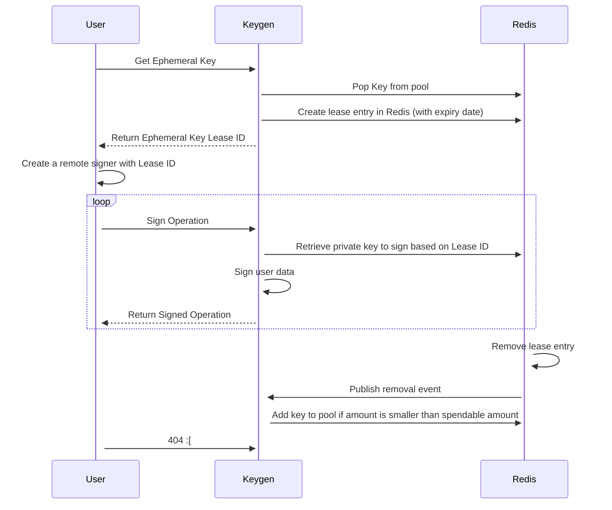

# Taquito Integration Tests


The `taquito/integration-tests` directory contains the integration test suite for Taquito. These tests are executed against live Tezos testnets, ensuring a comprehensive evaluation of various Taquito use cases.

The tests may also be run using Flextesa. This is useful for testing new features not in current test nets and for testing features around governance that benefit from shortened block processing times. As well Flextesa tests offer a secondary confirmation of the test net results.

Internally Taquito is tested with tests running in parallel. This is achieved using an application that generates new keys and funds them as needed per test.
The application is not publicly available. External users, therefore, must run the Taquito Integration Tests in sequence, one test at a time.

## Running Integration Tests Against a Tezos Testnet


To run tests in this environment, make sure you have:


- Taquito source code cloned to your local machine
- A compatible version of Node.js installed (see the top-level README.md)
- Successfully compiled Taquito (see the top-level README)


### Running all tests against all pre-configured testnets


From the `taquito/integration-tests` directory, run the following:


```
npm run test # This runs all tests against all pre-configured testnets
```


### Running all tests against a specific testnet


Depending on the current Tezos upgrade cycle, multiple testnet networks may be configured in the Taquito integration tests. To target a specific testnet, use environment variables found in `taquito/integration-tests/config.ts` (see the Configuration section below):


```
QENANET=true npm run test
```

## Configuration

Refer to the `taquito/integration-tests/config.ts` file for details on test configurations and target networks. Some configurations have default values that can be overridden using environment variables. Sometimes, you can use CLI commands to invoke a configuration instead of exporting it.


## CLI Options


If different testnets are configured in the `config.ts` file, you can run tests on a specific testnet using the command-line parameter for a test file:


```
npm run test:qenanet contract-with-bigmap-init.spec.ts
```


Or for a specific test within a test file:


```
npm run test:qenanet -- -t "Verify contract.originate for a contract and call deposit method with unit param"
```


## Running Tests Against a Specific RPC URL


To run tests against a node that is not pre-configured in Taquito, use:


`export TEZOS_RPC_QENANET='http://localhost:8732'`.

## Using a Secret Key Instead of the Keygen API


By default, the integration tests use an ephemeral key managed by the Keygen API, which requires internal access (for detail on Keygen see the below). However, to use a secret key of your own instead, use the CLI option `<testnet>-secret-key`, like this:


```
npm run test:qenanet-secret-key contract-with-bigmap-init.spec.ts
```


You can set your secret key (and password), or the `defaultSecretKey` from `config.ts` will be used:


```
export SECRET_KEY='edsk...'
```


If running the test with a configured secret key, ensure that the account balance is not zero.


## Test Report


To review the graphical report of the test run, open the index.html file in ~/taquito/integration-tests/jest-stare after each test run.


## Taquito Integration Tests with Flextesa

:::warning
Due to the discontinuation of Flextesa support from Protocol Oxford onwards, we unfortunately will not be testing against sandboxes anymore.

The only sandbox tests we're running points to the latest Nairobibox to specifically test for the `ballot` and `drain_delegate` operation.
:::

## The Keygen API

The Keygen API in Taquito is specifically designed for testing purposes. It allows developers to generate and manage key pairs (public and private keys) for Tezos accounts during the testing phase of their applications. This is useful for simulating various scenarios, such as transactions, smart contract interactions, and other on-chain operations, without the need to use real Tezos accounts or real funds.

This tool is employed internally for Taquito Integration tests within the Continuous Integration and Continuous Delivery (CI/CD) system.

### How the Keygen API works

