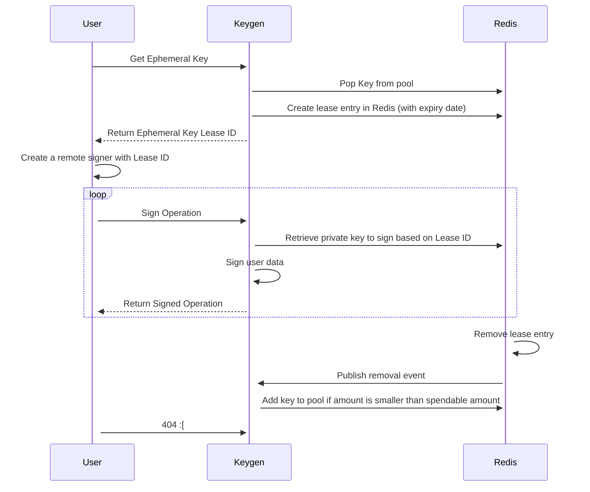

# Taquito Integration Tests

This directory contains the integration test suites for Taquito. These tests are executed against live Tezos testnets, ensuring a comprehensive evaluation of various Taquito use cases.

There are two ways for our **external users** to run our integration tests on live testnets. One is to use their **own secret key** with sufficient balance to run against a live testnet in sequence. The other is to spin up a docker **flextesa sandbox** to point tests to run against local sandbox rpc url.

Internally Taquito runs tests in parallel. This is achieved using a keygen application that generates new keys and funds them as needed per test. This is not publicly available. We also run test with Flextesa internally specifically for some irreversible behavior and voting operations which need to be performed with controlled bakers. Also, Flextesa tests offer a secondary confirmation of the testnet results.

## Prerequisite to run integration test

To run tests in this environment, make sure you have:

- Taquito source code cloned to your local machine `git clone https://github.com/ecadlabs/taquito.git`
- A compatible version of Node.js installed (see the top-level [README.md]( [README.md](https://github.com/ecadlabs/taquito#readme) )) )
- Successfully compiled Taquito (see the top-level  [README.md](https://github.com/ecadlabs/taquito#setup-and-build-taquito) ) `npm clean-install && npm run build`
- Get into integration-tests folder `cd integration-tests`

## [External] Using a Secret Key toward a live testnet

For example to run tests against ghostnet, we need to set up environmental variables `RUN_GHOSTNET_WITH_SECRET_KEY`, `SECRET_KEY`, `TEZOS_RPC_GHOSTNET` and if any `PASSWORD_SECRET_KEY`. This will configure our integration tests accordingly. (*note that secret key used will need sufficient balance for the tests to run successfully, here is a link of [faucet](https://teztnets.xyz/) to fund your account)

```
export RUN_GHOSTNET_WITH_SECRET_KEY=true &&
export SECRET_KEY=edsk... &&
export TEZOS_RPC_GHOSTNET=https://ghostnet.ecadinfra.com
&& export PASSWORD_SECRET_KEY=undefined // optional
```

 - To run entire integration test folder, we first originate known contract then run test like below. (*note that there will be some tests failed due to the assertion differ by rpc or node environment)

```
npm run originate-known-contracts &&
npm run test:ghostnet-secret-key
```

 - To run a single file that interact with known contract, we can run

```
npm run originate-known-contracts &&
npm run test:ghostnet-secret-key contract-batch.spec.ts
```

 - To run a single file that doesn't interact with known contract, we can simply run

```
npm run test:ghostnet-secret-key contract-with-bigmap-init.spec.ts
```

 - To run a single test we can specify it's description like this

```
npm run test:ghostnet-secret-key -- -t "Verify contract.originate for a contract and call deposit method with unit param"
```

## [External] Using flextesa sandbox

To run integration test against [flextesa](https://tezos.gitlab.io/flextesa/) sandbox will require [docker](https://docs.docker.com/get-docker/).

We have written a flextesa nairobi sandbox script that can be run like this. (If this command failed because lacking execution permission run this `chmod +x sandbox-script.sh` and below command again)

```
npm run start-nairobibox
```

- To run entire integration test folder, we have written a script to run

```
npm run test:nairobibox
```

- To run a single file that interact with known contract, we can run

```
source ./sandbox-env.sh &&
npm run originate-known-contracts &&
RUN_NAIROBINET_WITH_SECRET_KEY=true jest contract-batch.spec.ts
```

- To run a single file that doesn't interact with known contract, we can run

```
source ./sandbox-env.sh &&
RUN_NAIROBINET_WITH_SECRET_KEY=true jest contract-with-bigmap-init.spec.ts
```

- To run a single test we can specify it's description like this

```
RUN_NAIROBINET_WITH_SECRET_KEY=true jest -- -t "Verify contract.originate for a contract and call deposit method with unit param"
```

- To stop the flextesa sandbox

```
docker stop Nairobibox
```

- To test voting operations, can run

```
npm run start-nairobibox &&
source ./sandbox-env.sh &&
export SECRET_KEY=edsk... && // require a baker's secret_key
RUN_NAIROBINET_WITH_SECRET_KEY=true jest sandbox-ballot-operation.spec.ts
```
## For more detail
If you'd like to learn more, please reference these files for more commands to run test and how the tests are constructed.
```
integration-tests/package.json
integration-tests/originate-known-contracts.ts
integration-tests/config.ts
integration-tests/sandbox-script.sh
integration-tests/sandbox-env.sh
```

## Test Report

To review the graphical report of the test run
```
open jest-stare/index.html
```

## The Keygen API

The Keygen API in Taquito is specifically designed for testing purposes. It allows developers to generate and manage key pairs (public and private keys) for Tezos accounts during the testing phase of their applications. This is useful for simulating various scenarios, such as transactions, smart contract interactions, and other on-chain operations, without the need to use real Tezos accounts or real funds.

This tool is employed internally for Taquito Integration tests within the Continuous Integration and Continuous Delivery (CI/CD) system.

### How the Keygen API works

