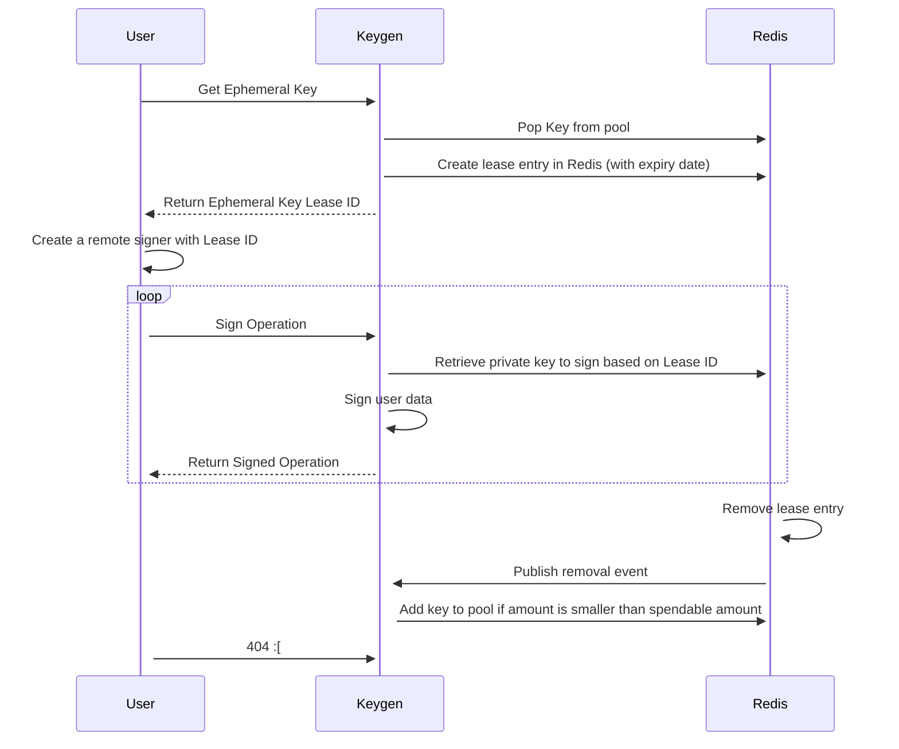

# Taquito Integration Tests


The `taquito/integration-tests` directory contains the integration test suite for Taquito. These tests are executed against live Tezos testnets, ensuring a comprehensive evaluation of various Taquito use cases.

The tests may also be run using Tezbox. This is useful for testing new features not in current test nets and for testing features around governance that benefit from shortened block processing times. As well Tezbox tests offer a secondary confirmation of the test net results.

Internally Taquito is tested with tests running in parallel. This is achieved using an application that generates new keys and funds them as needed per test.
The application is not publicly available. External users, therefore, must run the Taquito Integration Tests in sequence, one test at a time.

## Running Integration Tests Against a Tezos Testnet


To run tests in this environment, make sure you have:


- Taquito source code cloned to your local machine
- A compatible version of Node.js installed (see the top-level README.md)
- Successfully compiled Taquito (see the top-level README)


### Running all tests against all pre-configured testnets


From the `taquito/integration-tests` directory, run the following:


```
npm run test # This runs all tests against all pre-configured testnets
```


### Running all tests against a specific testnet


Depending on the current Tezos upgrade cycle, multiple testnet networks may be configured in the Taquito integration tests. To target a specific testnet, use environment variables found in `taquito/integration-tests/config.ts` (see the Configuration section below):


```
OXFORDNET=true npm run test
```

## Configuration

Refer to the `taquito/integration-tests/config.ts` file for details on test configurations and target networks. Some configurations have default values that can be overridden using environment variables. Sometimes, you can use CLI commands to invoke a configuration instead of exporting it.


## CLI Options


If different testnets are configured in the `config.ts` file, you can run tests on a specific testnet using the command-line parameter for a test file:


```
npm run test:oxfordnet contract-with-bigmap-init.spec.ts
```


Or for a specific test within a test file:


```
npm run test:oxfordnet -- -t "Verify contract.originate for a contract and call deposit method with unit param"
```


## Running Tests Against a Specific RPC URL


To run tests against a node that is not pre-configured in Taquito, use:


`export TEZOS_RPC_OXFORDNET='http://localhost:8732'`.

## Using a Secret Key Instead of the Keygen API


By default, the integration tests use an ephemeral key managed by the Keygen API, which requires internal access (for detail on Keygen see the below). However, to use a secret key of your own instead, use the CLI option `<testnet>-secret-key`, like this:


```
npm run test:oxfordnet-secret-key contract-with-bigmap-init.spec.ts
```


You can set your secret key (and password), or the `defaultSecretKey` from `config.ts` will be used:


```
export SECRET_KEY='edsk...'
```


If running the test with a configured secret key, ensure that the account balance is not zero.


## Test Report


To review the graphical report of the test run, open the index.html file in ~/taquito/integration-tests/jest-stare after each test run.


## Taquito Integration Tests with Tezbox

> **Be sure to use a working NVM! such as lts/hydrogen or lts/iron**

> The recommended method to run tests is against testnets, not sandboxes. Running all tests against a sandbox can fail randomly, while individual tests usually pass.

To prepare to run the integration tests against a local sandbox, perform the following steps:

### 1. Set environment variables

Execute

```bash
source integration-tests/sandbox-env.sh
```

from the top level. This will export the following environment variables:

```sh
RUN_OXFORDNET_WITH_SECRET_KEY=true
SECRET_KEY=edsk3RFfvaFaxbHx8BMtEW1rKQcPtDML3LXjNqMNLCzC3wLC1bWbAt
TEZOS_RPC_OXFORDNET=http://localhost:20000
POLLING_INTERVAL_MILLISECONDS=100
RPC_CACHE_MILLISECONDS=0
TEZOS_BAKER=tz1VSUr8wwNhLAzempoch5d6hLRiTh8Cjcjb
```

### 2. Start a Tezbox sandbox to run a local Oxford testnet

Start the docker container, which encapsulates the tezbox_sandbox:

```sh
docker run -d -p 20000:20000 ghcr.io/tez-capital/tezbox:tezos-v19.1 oxfordbox
```

The default block time is 5 seconds. Tezbox enables you to run a local emulation of the blockchain. Please find [more information about Tezbox here](https://github.com/tez-capital/tezbox).

### 3. Run the integration tests
*Note: It is no longer necessary to `cd` into the `integration-tests/` directory*

To run the integration tests, use the command `npm run integration-tests`. The integration test suite will execute all tests against the current Tezos protocol (Oxford) sandbox and typically also against the previous and next protocol testnets. You can find specific test targets in the `scripts` property in the `integration-tests/package.json` file.

Remember that the first time you run the integration tests, `docker` will download the required image, which might take some time.

Before running the tests, make sure the file `~/taquito/integration-tests/known-contracts-ProxfordY.ts` includes the following:

```ts
import { KnownContracts } from './known-contracts';
export const knownContractsProxfordY: KnownContracts = {
  contract: "KT1UTWPed6L8pNmWJJhPgwLELxmpua18nvZB",
  bigMapContract: "KT1TpJY5K5wg9dYgMhLpcvmPnreE4trxkCdh",
  tzip12BigMapOffChainContract: "KT1PxJcsmPm365VGCbopTz7411kwF7u1mFkv",
  saplingContract: "KT1PPnjL9TudMnZ23UmnGkCLbZ7TiMjNUVhe",
  onChainViewContractAddress: "KT1Mc9DhvGtZPCg5TobjZdgHheCmDERUYCTj",
};
```

These contracts will be originated when the tests are first run, but the file will be emptied afterward. You'll need to repopulate it if you want to rerun the tests.

Next, set the required environment variables for the Flextesa run:

```bash
source integration-tests/sandbox-env.sh
```

When running Flextesa tests, you must pass the Jest config `--runInBand`, as they only have one baking account, and tests must run sequentially.


```bash
npm -w integration-tests run originate-known-contracts && npm -w integration-tests run test:oxfordnet-secret-key --runInBand
```

If you're running the tests for a second time in the same session, you don't need to originate the test contracts again. Instead, use the following:

```bash
npm -w --runInBand integration-tests run test:oxfordnet-secret-key
```

Some tests might fail due to test data discrepancies, such as changes in RPC endpoints or estimated gas costs from one protocol to another. You can skip these tests using the following:

```bash
npm -w integration-tests run test:oxfordnet-secret-key -- --testPathIgnorePatterns integration-tests/__tests__/ledger/ledger-signer-failing-tests.spec.ts integration-tests/__tests__/ledger/ledger-signer.spec.ts integration-tests/__tests__/contract/estimation-tests.spec.ts integration-tests/__tests__/rpc/get-protocol-constants.spec.ts'
```

You can also avoid slow-running tests. For example, if you want not to run the `sapling*.spec.ts` tests, run:

```bash
npm -w integration-tests run test:oxfordnet-secret-key -- --runInBand --testPathIgnorePatterns integration-tests/__tests__/ledger/ledger-signer-failing-tests.spec.ts integration-tests/__tests__/ledger/ledger-signer.spec.ts integration-tests/__tests__/contract/estimation-tests.spec.ts integration-tests/__tests__/rpc/get-protocol-constants.spec.ts' __tests__/sapling/sapling-batched-transactions.spec.ts __tests__/sapling/sapling-transactions-contract-with-multiple-sapling-states.spec.ts __tests__/sapling/sapling-transactions-contract-with-single-state.spec.ts __tests__/sapling/sapling-transactions-proof-using-proving-key.spec.ts'
```

Upon successfully starting the tests with contract origination, you should see the following output:

```bash
integration-tests@16.1.2 test:originate-known-contracts
node -r ts-node/register originate-known-contracts.ts
ProxfordYmVfjWnRcgjWH36fW6PArwqykTFzotUxRs6gmTcZDuH
knownContract address: KT1UTWPed6L8pNmWJJhPgwLELxmpua18nvZB
::set-output name=knownContractAddress::KT1UTWPed6L8pNmWJJhPgwLELxmpua18nvZB
knownBigMapContract address: KT1TpJY5K5wg9dYgMhLpcvmPnreE4trxkCdh
::set-output name=knownBigMapContractAddress::KT1TpJY5K5wg9dYgMhLpcvmPnreE4trxkCdh
knownTzip12BigMapOffChainContract address: KT1PxJcsmPm365VGCbopTz7411kwF7u1mFkv
::set-output name=knownTzip12BigMapOffChainContractAddress::KT1PxJcsmPm365VGCbopTz7411kwF7u1mFkv
knownSaplingContract address: KT1PPnjL9TudMnZ23UmnGkCLbZ7TiMjNUVhe
::set-output name=knownSaplingContractAddress::KT1PPnjL9TudMnZ23UmnGkCLbZ7TiMjNUVhe
knownOnChainViewContractAddress address: KT1Mc9DhvGtZPCg5TobjZdgHheCmDERUYCTj
::set-output name=knownOnChainViewContractAddressAddress::KT1Mc9DhvGtZPCg5TobjZdgHheCmDERUYCTj

Public Key Hash : tz1YPSCGWXwBdTncK2aCctSZAXWvGsGwVJqU
Initial Balance : 90856887.13687 XTZ
Final Balance : 90856909.589235 XTZ
Total XTZ Spent : -22.452365 XTZ

> integration-tests@16.1.2 test:oxfordnet-secret-key
> RUN_OXFORDNET_WITH_SECRET_KEY=true jest --runInBand
RUNS  ./contract-manager-scenario.spec.ts
PASS  ./contract-manager-scenario.spec.ts (6.167 s)
```

## The Keygen API

The Keygen API in Taquito is specifically designed for testing purposes. It allows developers to generate and manage key pairs (public and private keys) for Tezos accounts during the testing phase of their applications. This is useful for simulating various scenarios, such as transactions, smart contract interactions, and other on-chain operations, without the need to use real Tezos accounts or real funds.

This tool is employed internally for Taquito Integration tests within the Continuous Integration and Continuous Delivery (CI/CD) system.

### How the Keygen API works

