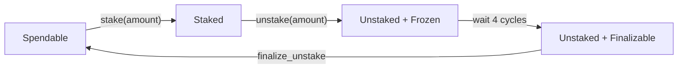

import Tabs from '@theme/Tabs';
import TabItem from '@theme/TabItem';

# Staking and Adaptive Issuance

Staking is an update to the "Proof of Stake" Mechanism in Tezos.

Before Staking, the only way for Tez holders to participate in the network was by delegating their tokens to a baker. Delegated funds contributed to a delegate's voting and baking power, but were not subject to staking: they could not be slashed in case the baker misbehaved. This is a useful feature for many users, but limits the total amount of staked tez to the amount of tez that bakers themselves hold. In other words, participating in the "Proof of Stake" mechanism required setting up and maintaining a baker, which is a significant barrier to entry for many users.

Staking changes this by allowing any user to participate in the "Proof of Stake" mechanism without setting up a baker. Users can now stake their tokens to their delegates, and their staked tokens will be subject to slashing in case of delegate/baker's misbehaviour. This allows the total amount of staked Tez to be much higher than the amount of tez that bakers themselves hold, which in turn increases the security of the network.

Users can control their staked funds using the `stake`, `unstake`, and `finalize_unstake` operations. These are implemented as pseudo-entrypoints, and the parameters are passed to a transfer operation with the same destination as the sender.

To accept staked funds, a delegate needs to have opted in to staking. This is done by `set_delegate_parameters`. This part is not supported by Taquito, as it is not a dApp operation. More information [here](https://octez.tezos.com/docs/rio/staking.html#staking-policy-configuration).

# Staking Funds
To stake your funds, you need to call the `stake` operation.
Before you can stake your funds, two conditions should be met:
1. You need yor have delegated your funds to a delegate before you can stake them (by calling [`setDelegate`](#set_delegate))
1. Your delegate should accept staking by calling `set_delegate_parameters`


<Tabs
defaultValue="contract"
values={[
{label: 'Contract Api', value: 'contract'},
{label: 'Wallet Api', value: 'wallet'}
]}>
  <TabItem value="contract">

```javascript

const op = await Tezos.contract.stake({
        amount: 100,
        mutez: false
      });
      await op.confirmation();

```

  </TabItem>
  <TabItem value="wallet">

```javascript

const op = await Tezos.wallet.stake({
        amount: 100,
        mutez: false
      }).send();
      await op.confirmation();

```

  </TabItem>
</Tabs>

# Unstaking Funds

To unstake your funds, you need to call the `unstake` operation. This will change your fund's status to "Unstaked + Frozen"
The unstaked funds will still be frozen (and subject to slashing for 4 cycles). After that, your funds will be in "Unstaked + Finalizable" state.

<Tabs
defaultValue="contract"
values={[
{label: 'Contract Api', value: 'contract'},
{label: 'Wallet Api', value: 'wallet'}
]}>
  <TabItem value="contract">

```javascript

const op = await Tezos.contract.unstake({
        amount: 50,
        mutez: false
      });
      await op.confirmation();

```

  </TabItem>
  <TabItem value="wallet">

```javascript

const op = await Tezos.wallet.unstake({
        amount: 50,
        mutez: false
      }).send();
      await op.confirmation();

```

  </TabItem>
</Tabs>

# Finalizing Unstake

To finalize your unstaked funds, you need to call the `finalize_unstake` operation. This will change your fund's status back to "spendable".

<Tabs
defaultValue="contract"
values={[
{label: 'Contract Api', value: 'contract'},
{label: 'Wallet Api', value: 'wallet'}
]}>
  <TabItem value="contract">

```javascript

const op = await Tezos.contract.finalizeUnstake();
      await op.confirmation();

```

  </TabItem>
  <TabItem value="wallet">

```javascript

const op = await Tezos.wallet.finalizeUnstake().send();
      await op.confirmation();

```

  </TabItem>
</Tabs>

# Additional Info and Some Notes

## Cycle
A cycle is 10800 blocks in Rio protocol, and 8 seconds per block in Rio. This means a cycle is about 2 days. This might change with the activation of newer protocols.

## Overstaking
A delegate can set the maximum amount of staking they can accept, as a multiply of their own balance. If a delegate's limit is exceeded, the exceeding stake is automatically considered as delegation for the delegate's baking and voting power calculation, but it does remain slashable. That means it's your responsibility to make sure you're not overstaking. Remember that overstaking can even happen after you have staked successfully, because your delegate changes their own balance, or their staking parameter.


## Changing Delegate
When you change your delegate, your funds will be automatically unstaked. You will have to wait for 4 cycles before you can stake them again.

## No need to finalize_unstake in some cases
The `stake` and `unstake` operations will automatically finalize all currently finalizable funds.

## Adaptive Issuance
A concept related to staking is adaptive issuance. Adaptive issuance is a mechanism that adjusts the block reward based on the total amount of staked tez. In short, the reward will be adjusted to keep the staked funds about 50% of the total supply. To read more about the mechanism, you can check [this document](https://tezos.gitlab.io/rio/adaptive_issuance.html#adaptive-issuance).

## Staking Rewards
In delegation, rewards were given to the baker, and it was the baker's responsibility to distribute the rewards to the delegators. In staking, the rewards are given directly to the staker. However, rewards are not given immediately, but are distributed through staked (frozen) balance, and the user can spend the reward along with their initial stake when they `unstake` and `finalize_unstake`.

## Lifetime of Staked Funds

Before you stake some of your Tez, it is in "Spendable" state. When you stake it, it will be in "Staked" state. When you unstake it, it will be in "Unstaked + Frozen" state, this fund is still subject to slashing. After 4 cycles, it will be in "Unstaked + Finalizable" state. You can finalize it to make it "Spendable" again.


